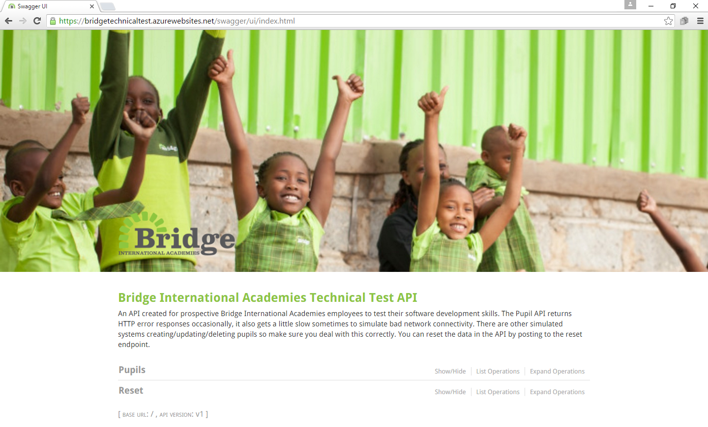

# Android Technical Test

## Technical Test API

The Technical Test API is a RESTful web service that makes uses of basic HTTP GET, POST, PUT and DELETE calls. The API documentation can be accessed [here](https://androidtechnicaltestapi-test.bridgeinternationalacademies.com/swagger/index.html).

## App Requirements

The requirements from the business owner are:

1. I need to be able to see a list of all pupils.
2. I need to be able to drill down into a detailed display for a single pupil.
3. I need to be able to add a new pupil and submit.
4. I need to be able to delete a pupil.
5. The above requirements should continue when I am offline.  With data synchronising when I'm next online.

In addition, you should also:

1. Write a short ReadMe about your code, your design, assumptions made and which requirements are implemented.
2. Write production quality code.
3. Submit your source code as a .zip file. Also, do not include any binary files in your final solution.

## App Flow

Thanks for the opportunity.
I have used the following technologies in building the app.
1. Android navigation components
2. Data Binding
3. MVVM architecture
4. RX Java
5. Broadcast Receivers and Intent Services
6. ROOM ORM

The app flow is as follows:
A single activity, MainActivity is the starting point. I have used android navigational components to connect the pupil list fragment and pupil detail fragment to it. It basically handles all the fragment transaction work for us in a very smooth manner.

Next, the app uses MVVM (Model-View-ViewModel) architecture .
The app begins from PupilListFragment which communicates with PupilViewModel to display the list of pupils.
PupilViewModel fetches the data from local db and returns a live data attached to it. Simultaneosuly, it makes an asynchronous call to Backend to fetch the list of pupils. When the pupils are received from Backend, they are stored in local DB and returend to the caller (in this case PupilListFragment).
PupilListFragment uses a recycler view to show all the list of pupils.
Whenever, a pupil is clicked in the recycler view, PupilDetailFragment opens up.
This fragment (like the PupilListFragment) also communicates with the same PupilViewModel to fetch the PupilView detail info. And simultaneosuly makes a call to Backend to fetch the same. Whenever, a response is received the data in local DB is updated.

To handle deletes, there is a button on the PupilDetailFragment.
There are 2 cases, when the user clicks on delete button
1. Internet connection is avaialable
2. Internet connection is not available

The above scenarios works as follows:
1. Interet connection is there -> In this case, a call is made to Backend to delete the pupil. When deleted the pupil is also deleted from the local DB. If not deleted and there is some error in deleting, we remove this pupil from deletion queue.
2. Internt connection is not there -> We set the flag toBeDeleted to TRUE in local DB. A broadcast receiver is created to listen to netowork changes. Whenever, there is an active internet connection, all those pupils are fetched from local DB with flag toBeDeleted = TRUE and a backend call is made to delete these pupils. Also, since there is no internet connection, hence to indicate the pupil is to be deleted, we show a text , "TO BE DELETED" in RED both in list and detail screen to indicate that this user is in queue to be deleted.

## Future Scope

1. Can add a swipe refresh indicator on the list screen. Hence, need to re-open app again to see updated data. 
2. Can add a retry logic whenever a network call fails . 
3. Did not implement add or update pupil. Both cases work on similar lines as the deletion scenarios. If network is not there, both can be saved into local DB with a boolean flag to indicate that a new user is to be created or an existing one has to be updated. And can be synced to Backend whenever , there is an active internet connection.
4. Did not write unit test cases as dont have much experience in it to be honest.

The above points were not done due to time constraints. Had there been more time, app could have been made much better.
Thanks
